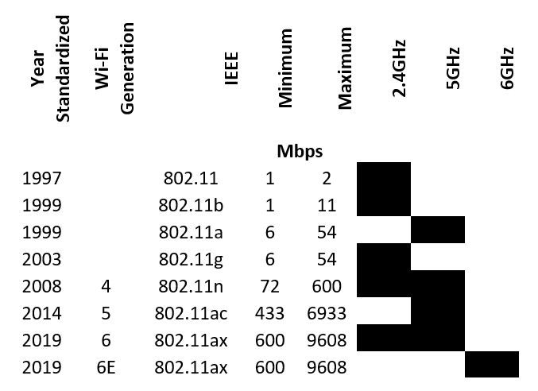

# Fundamentals

Ethernet was designed to be the simplest protocol possible for a LAN. At layer two, data is broken up into discrete “lumps” of <=1,500 bytes and we call this a frame. There are _Jumbo Frames_ which are much larger, we will not cover them at this stage, but do some background reading on the topic.

To allow a frame to be announced, there is a _preamble_ of eight bytes. The rest of the frame is made up of a destination address, a source address and the data we need to send. There can also be additional fields which give data about the frame such as type or length. Finally, there is a _frame check sequence_ (FCS) which allows the receiver to check for any errors. &#x20;

<figure><figcaption></figcaption></figure>

Every Ethernet card in the world has a unique address called a Media Access Control or MAC Address. This is forty-eight bits long or six bytes.

The first three bytes are assigned to the company manufacturing the card; this is the _Organisation Unique Identifiers_ (OUI). The next three bytes are uniquely assigned when the card is being programmed. This is very significant from the perspective of forensics; you can identify the manufacturer and the device just by getting the MAC address from one frame!

The IEEE holds the [master database](http://standards-oui.ieee.org/oui.txt) of these MAC addresses.

There are some special addresses and we will consider one of them here.&#x20;

0xFFFFFF is the _broadcast address_, a special address intended to be read and processed by every node on the Ethernet network.
